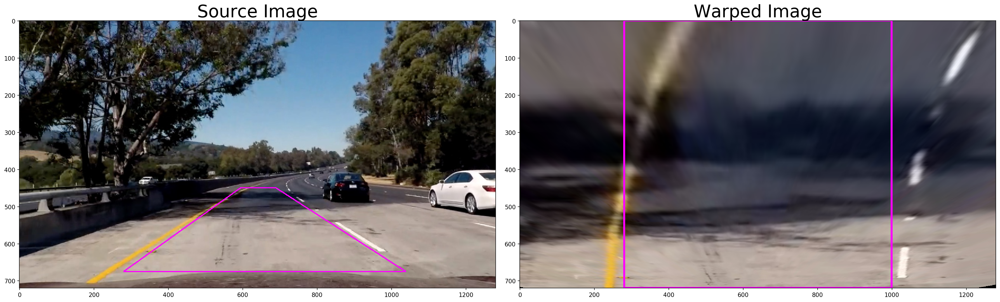

# Advanced Lane Finding Project
## Overview
In this project, a software pipeline with the use of computer vision techniques is written to identify the lane boundaries in a video from a front-facing camera on a car. The output of the pipeline is a video with lane lines identified and estimation of road curvature as well as vehicle location with respect to the center of the lane. 


### The Goals of this Project:
* Compute the camera calibration matrix and distortion coefficients given a set of chessboard images.
* Apply a distortion correction to raw images.
* Use color transforms, gradients, etc., to create a thresholded binary image.
* Apply a perspective transform to rectify binary image ("birds-eye view").
* Detect lane pixels and fit to find the lane boundary.
* Determine the curvature of the lane and vehicle position with respect to center.
* Warp the detected lane boundaries back onto the original image.
* Output visual display of the lane boundaries and numerical estimation of lane curvature and vehicle position.

### Project Files
The project includes the following files:
* `README.md` - A markdown file explaining the project structure and training approach
* `image_undist.py` - Script used for camera calibration and distortion correction
* `image_thresholds.py` - Script used for color and Sobel gradients transformation to create a thresholded binary image
* `perspective_transform.py` - Script used to apply a perspective transform ("birds-eye view") 
* `lane_lines.py` - Script with function to detect lane lines, lane curvature and vehicle position
* `image_pipeline.py` - Image processing pipeline to find the lane lines in images
* `video_pipeline.py` - Image processing pipeline to find the lane lines in video frames
* `output_video.mp4` - A video recording with lane lines identified

## Camera Calibration
The first step is to correct the distorsion of images by calibrating the camera. Image distortion occurs when a camera looks at 3D objects in the real world and transforms them into a 2D image; this transformation isn’t perfect. Distortion actually changes what the shape and size of these 3D objects appear to be. So, the first step in analyzing camera images, is to undo this distortion so that you can get correct and useful information out of them. Without that the apparent size, shape of an object in an image is incorrect.

There are two main steps to this process: use chessboard images to obtain image points and object points, and then use the OpenCV functions `cv2.calibrateCamera()` and `cv2.undistort()` to compute the calibration and undistortion.


The code as well as its description is saved in the [image_undist.py](image_undist.py) file. The file contains two functions:
* `cam_calibration()` - Calculates object points, image points and performs camera calibration parameters
* `image_undistort()` - Performs image distortion correction and returns the undistorted image 


Here is how to run the Python script that calculates camera matrix, distortion coefficients from calibration images and undistort the images:

``` 
>python image_undist.py -h
usage: image_undist.py [-h] [-p PATH]

optional arguments:
  -h, --help            show this help message and exit
  -p PATH, --path PATH  specify path to calibration image files (without -p
                        the default is: ./camera_cal/calibration*.jpg)
```
To specify your own path to calibration images, simply use wildcard symbol `*.jpg` to read all jpg images as follows
```
>python image_undist.py -p ./your_folder/*.jpg
```

Here is a result of applying [image_undist.py](image_undist.py) on an image 


## Pipeline (Single Images)

### 1. Examples of a Distortion-corrected Images
Here is an example of applying the camera calibration parameters on test images in order to undistort them. 


One can observe that there is a difference between distored (left column) and undistored (right column) images especialy apparent close to the edges showing that the distortion was corrected. These images will be taken as input to the image and video pipeline.

### 2. Image Thresholds
The goal of this step is to apply different types of image filters in order to produce binary image with pixels representing lane lines and ideally nothing else on the road.

For this, I combined color and gradient thresholding to filter all non-relevant pixels other than the lane lines.

The following filters were used:

* `abs_sobel_thresh()` - Function that applies Sobel x (=first derivative in x direction), then takes an absolute value and applies a threshold. This is applied on the 's' channel of HLS color space

* `lab_thresh()` - Function that converts RGB image to LAB color space. It allows to extract each channel by specifying the parameter `channel='b'`.  

I tuned the thresholds for each filter manually and combined them togheter with logical operators `&` and `|` to come up with the best result. This combination is defined in function called `thresholds()`. 

The code as well as its description is saved in the [image_thresholds.py](image_thresholds.py) file. 

Here is how to run the Python script that calculates generates the binary thresholded image:

``` 
>python image_thresholds.py -h
usage: image_thresholds.py [-h] [-p PATH]

optional arguments:
  -h, --help            show this help message and exit
  -p PATH, --path PATH  specify path with image file name as PATH (without -p
                        the default is: test_images/test5.jpg)
```

To specify your own path to an image, simply use optional parameter `-p` and type file path to the image as follows
```
>python image_thresholds.py -p ./your_folder/image_name.jpg
```

Here is a result of applying [image_thresholds.py](image_thresholds.py) on an image to obtain the final thresholded binary image: 


### 3. Perspective Transform
A perspective transform maps the points in a given image to different, desired, image points with a new perspective. The perspective transform that's of the most interest in this project is a bird’s-eye view transform that let’s us view a lane from above; this will be useful for calculating the lane curvature later on. 

To generate output of bird-eye like image of a road, I will write a function that takes the undistorted image as input and completes the following steps:

- Define 4 source points - the x and y pixel values of four points on the road in a trapezoidal shape that would represent a rectangle when looking down on the road from above. I chose an image where the lane lines are straight, and find four points lying along the lines that, after perspective transform, make the lines look straight and vertical from a bird's eye view perspective.

- Define 4 destination points - are the x and y pixel values of where we want those four corners to be mapped to in the output image (must be listed in the same order as src points!)

- Use `cv2.getPerspectiveTransform()` -  calculates a perspective transform from four pairs of the corresponding points and to returns `M`, the transform matrix

- Use `cv2.warpPerspective()` - applies a perspective transformation to an image by using `M` and returns transformed image to a top-down view

I chose to hardcode the source and destination points as follows:

```python
# Define four source coordinates (calibration box)
src = np.array([[689,450],
                [1038,675], 
                [280,675],
                [594,450]], dtype=np.float32)
    
# Four desired or warped (dst - destination) points
offset = 280   
dst = np.float32([[1279-offset, 0],
                  [1279-offset, 719],
                  [offset, 719],
                  [offset, 0]])
```

This resulted in the following source and destination points:

| Source        | Destination   | 
|:-------------:|:-------------:| 
| 689,450       | 999, 0        | 
| 1038,675      | 999, 719      |
| 280,675       | 280, 719      |
| 594,450       | 280, 0        |


For curved lines, the same four source points will now work to transform any image (under the assumption that the road is flat and the camera perspective hasn't changed). When applying the transform to new images, the test of whether or not you got the transform correct, is that the lane lines should appear parallel in the warped images, whether they are straight or curved.

The code that defines perspective transform as well as its description is saved in the [perspective_transform.py](perspective_transform.py) file. The file contains a function called `image_warp()` that can be set in reverse mode to calculate inverse perspective transform with `reversed=True`.

Here is how to run the Python script that calculates camera matrix, distortion coefficients from calibration images and undistort the images:

``` 
>python perspective_transform.py -h
usage: perspective_transform.py [-h] [-p PATH] [-b]

optional arguments:
  -h, --help            show this help message and exit
  -p PATH, --path PATH  specify path with image file name as PATH (without -p
                        the default is: test_images/test5.jpg)
  -b, --box             plot calibration box in source (original) and
                        destination (desired or warped) coordinates
```
To specify your own path to an image, simply use optional parameter `-p` and type file path to the image as follows
```
>python perspective_transform.py -p ./your_folder/image_name.jpg
```

Below is an example of applying a perspective transform to an image, showing that the curved lines are (more or less) parallel in the transformed image:



### 4. Lane Lines Detection
After applying calibration, thresholding, and a perspective transform to a road image, we should have a binary image where the lane lines stand out clearly. In this step we still need to decide explicitly which pixels are part of the lines and which belong to the left line and which belong to the right line.

To do so and in order to detect lane lines from the warped binary thresholded image, I used two methods that search for the pixels representing left and right lane line.

* **Sliding Window** - uses a histogram of where the binary activations occur across the image. It identifies left and right lane line from maximum peaks in the histogram and centers one window for each line around the histogram amplitude peak. Then it scans the image from bottom to top and counts the number of pixels in each window. If the count exceeds minimum number of pixels set to `minpix = 50` it recenters the next window at the mean of x position of the pixels. This is repeated for the number of sliding windows set to `nwindows = 20`. It then uses a second order polynomial to fit to each lane pixel using `np.polyfit`.

* **Search Around Polynomial** - This algorithm uses the previously fitted polynomial from Sliding Window algorithm to just search around it in a range set by `margin`. This proves to be more efficient that starting always from scratch with Sliding Window algorithm and it's based on the assumption that the curvature is smooth without drastic changes in curvature (i.e. instant change from sharp right curve to sharp left curve). 

The code that defines lane lines finding algorthms as well as its description is saved in the [lane_lines.py](lane_lines.py) file. The file contains a function called `sliding_window()` that defines Sliding Window algorithm and `search_around_poly()` function for Search Around Polynomial algorithm. It also contains other auxiliary functions such as `fit_poly()` to fit a second order polynomial with np.polyfit(). More details in the the source code.

Here is a result of applying Sliding Window algorithm on an image to detect lane lines: 


And here is a result of applying Search Around Polynomial algorithm to detect lane lines in the margin around the polynomial fit: 


### 5. Lane Curvature and Vehicle Position with respect to Lane Center

In this step we'll compute the radius of curvature of the second order polynomial fit and vehicle position with respect to the center of the lane. 

The radius of curvature for the second order polynomial is a function of y coordinate and is given as follows:

$R_curve = \frac{(1+(2Ay+B)^2)^3/2}{∣2A∣}$


### 6. Final Image Pipeline 

## Pipeline (Video)


Here's a link to my [video](output_video.mp4) result

## Discussion

